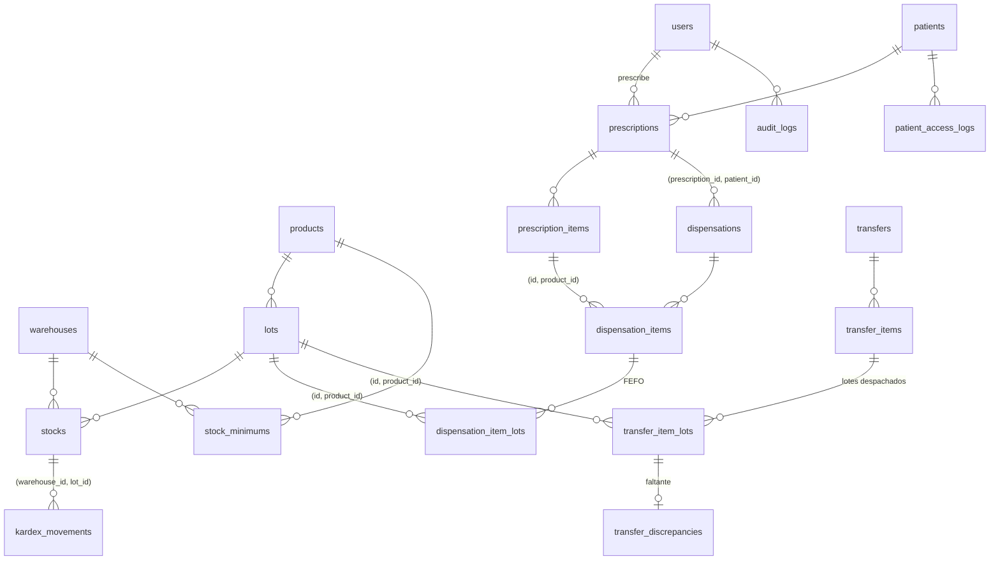

# Modelo de datos

PostgreSQL 16. Principio: **cada regla de negocio que se puede expresar en la BD se defiende en la BD** (CHECK, UNIQUE, FK, triggers), además de en el código. Así un bug en un servicio, un script manual o una condición de carrera no pueden dejar datos inválidos.

## Diagrama

## Tablas y defensas en BD

| Tabla | Defensas | Regla |
|---|---|---|
| `users` | `role` CHECK en los 5 roles | §5 |
| `warehouses`, `products` | `code` UNIQUE y no vacío | — |
| `lots` | UNIQUE `(product_id, lot_number)`; UNIQUE `(id, product_id)` como destino de FK compuestas; índice `(product_id, expires_at, id)` para FEFO | RN-01, RN-02 |
| `stocks` | `quantity >= 0`; UNIQUE `(warehouse_id, lot_id)`; FK compuesta `(lot_id, product_id) → lots`; índice parcial `WHERE quantity > 0` | RN-01, RN-03 |
| `stock_minimums` | `min_quantity >= 0`; UNIQUE `(warehouse_id, product_id)` | RN-11 |
| `kardex_movements` | `type` CHECK; `quantity > 0`; `direction IN (-1, 1)` y coherente con el tipo; `balance_after >= 0`; AJUSTE exige `reason` no vacío; FK `(warehouse_id, lot_id) → stocks`; FK `(lot_id, product_id) → lots`; **trigger que bloquea UPDATE/DELETE** | RN-06 |
| `patients` | `document_number` y `phone` cifrados (cast `encrypted`); `document_hash` HMAC UNIQUE; `document_type` CHECK | RN-10 |
| `prescriptions` | `status` CHECK; `valid_until >= issued_at` | RN-04 |
| `prescription_items` | `quantity_prescribed > 0`; `quantity_dispensed >= 0`; **`quantity_dispensed <= quantity_prescribed`**; UNIQUE `(prescription_id, product_id)` | RN-04 |
| `dispensations` | `status` CHECK; `idempotency_key` UNIQUE; **`authorized_by <> created_by`**; controlado COMPLETADA ⇒ autorizado; RECHAZADA ⇒ quién/cuándo/motivo; FK `(prescription_id, patient_id)`; trigger: quien autoriza/rechaza es `regente_farmacia` | RN-04, RN-05, RN-09 |
| `dispensation_items` / `dispensation_item_lots` | cantidades `> 0`; FK compuestas que obligan a que el lote sea del producto prescrito | RN-02, RN-04 |
| `transfers` | `status` CHECK (7 estados); origen ≠ destino; **`approved_by <> requested_by`**; cada estado exige sus actores/fechas; ANULADO solo sin `dispatched_at`; trigger: quien aprueba es `regente_farmacia` | RN-07, RN-08 |
| `transfer_items` / `transfer_item_lots` | cantidades `> 0`; `0 <= quantity_received <= quantity_dispatched`; FK compuestas lote/producto | RN-07 |
| `transfer_discrepancies` | `quantity_missing > 0`; `status` CHECK; RESUELTA ⇒ resolución, quién y cuándo | RN-07 |
| `patient_access_logs`, `audit_logs` | **trigger append-only**; solo IDs (sin PII) | RN-10 |

Funciones PL/pgSQL compartidas (migración `create_db_guard_functions`): `forbid_append_only_mutation()` y `assert_user_role()`.

## Lo que la BD NO garantiza (lo hace el código en `app/Domain`, Fase 2)

- FEFO y no dispensar/trasladar lotes vencidos (depende de "hoy").
- Que `balance_after` sea exactamente el saldo anterior ± cantidad (se garantiza bloqueando la fila de `stocks` con `FOR UPDATE` y escribiendo stock y kardex en la misma transacción).
- Transiciones válidas de la máquina de estados del traslado (la BD solo exige coherencia estado/actores y anulación antes del despacho).
- Vigencia de la prescripción por fecha.

## Usuarios de demo (solo desarrollo local)

Contraseña de todos: `password`.

| Email | Rol |
|---|---|
| admin@fartmar.test | admin |
| regente@fartmar.test | regente_farmacia |
| regente2@fartmar.test | regente_farmacia (segundo regente para RN-05 / RN-08) |
| auxiliar@fartmar.test | auxiliar_farmacia |
| medico@fartmar.test | medico |
| auditor@fartmar.test | auditor |
